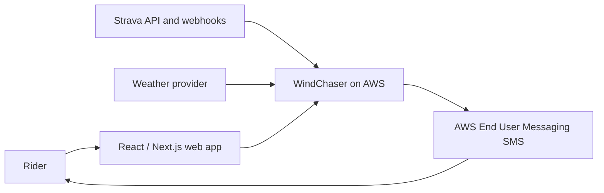
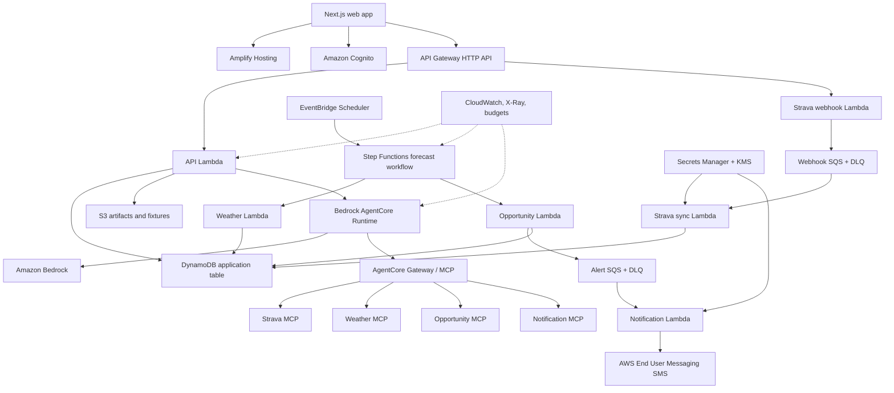

# AWS Architecture

## Design intent

WindChaser uses a serverless, event-driven AWS architecture to minimize idle cost
while retaining the components expected in a production AI application. The
deterministic opportunity pipeline and the interactive Bedrock agent are separate
failure and cost domains.

## Context

## Logical architecture

## Request paths

### Public demo

The public site loads pre-generated, sanitized JSON fixtures from the web build or
S3/CloudFront cache. It does not call Strava, weather, Bedrock, AgentCore, or SMS.
This keeps portfolio traffic predictable and almost free.

### Authenticated dashboard

The browser obtains Cognito tokens and calls an API Gateway HTTP API. Lambda reads
precomputed opportunities from DynamoDB. It does not calculate forecasts in the
request path. This produces fast pages and avoids request-time fan-out.

### Forecast sweep

EventBridge starts a Step Functions workflow on a coarse schedule. It selects due
segments, groups/caches weather requests, calculates opportunity windows, and emits
only qualifying notification events. A more frequent schedule may be activated for
the final hours before a promising window.

### SMS alert

The opportunity engine writes an idempotency record and sends an event to SQS. The
notification worker checks consent, suppression, cooldown, quiet hours, and
forecast version before sending. Delivery events update the notification record and
metrics.

### Copilot

The authenticated API starts or resumes an AgentCore session. The Strands agent
uses a Bedrock model and discovers authorized tools through AgentCore Gateway. Tool
results contain the numerical evidence; the model synthesizes an explanation. The
UI receives a streamed answer and a sanitized trace.

## Environment strategy

### Development

- One low-cost AWS environment.
- Owner-only Strava account and verified SMS destination.
- Short log retention and low spending limits.
- Fixture/replay mode enabled by default.
- Optional AgentCore deployment that can be disabled when not being demonstrated.

### Production

- Separate Terraform state and IAM deployment role.
- Public demo plus authenticated owner workflow initially.
- Registered SMS origination identity before broader user onboarding.
- Protected GitHub environment approval.
- Longer but still bounded operational retention.

Separate AWS accounts are ideal. If a single account is used for a portfolio MVP,
resource names, state, KMS keys, roles, and budgets remain environment-specific.

## Resource selection rationale

| Need | Choice | Reason |
|---|---|---|
| Web hosting | Amplify Hosting | Managed Next.js deployment, CDN, preview support |
| Browser API | API Gateway HTTP API | Lower cost and simpler than REST API for required features |
| Compute | Lambda | No idle cost; workloads are short and event-driven |
| Orchestration | Step Functions Standard initially | Visible durable workflows; evaluate Express after measuring volume |
| Queueing | SQS | Retry isolation, buffering, DLQ support |
| Operational data | DynamoDB on-demand | Scale-to-zero-like usage economics and simple access patterns |
| Artifacts | S3 | Inexpensive durable storage and lifecycle controls |
| Authentication | Cognito | AWS-native user identity and JWT integration |
| Secrets | Secrets Manager | Rotation-ready secret storage; minimize number of secrets |
| Model | Bedrock | Managed model access and evaluation/guardrail ecosystem |
| Agent runtime | AgentCore Runtime | Managed agent sessions, identity, deployment, and observability |
| MCP gateway | AgentCore Gateway | Governed tool discovery and invocation |
| SMS | End User Messaging SMS | Native AWS transactional delivery and status reporting |
| IaC | Terraform | Requested portable declarative infrastructure |

## Boundaries and degradation

- If Bedrock or AgentCore fails, scheduled scores and SMS can still run using a
  deterministic message template.
- If Strava fails, cached segment geometry remains usable; new effort analysis is
  delayed.
- If weather fails, no new alert is sent unless minimum coverage and freshness are
  satisfied.
- If SMS fails, the opportunity remains visible in-app and delivery is retried
  through SQS within policy limits.
- Provider adapters expose normalized contracts so weather or map vendors can be
  replaced without changing the opportunity engine.

